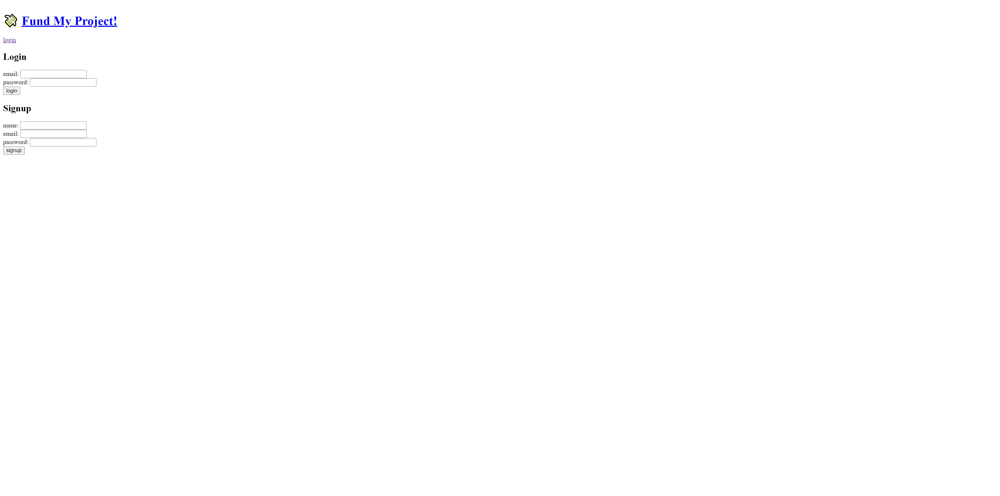

# Full Stack Blog
  
## Description
In challenge 14 we were asked to create a full stack blog app that would allow you to share your thoughts with others. This project helped me put everything together to make a full stack application.
## Table of Contents
1. [Install](#install)
2. [Usage](#usage)
3. [Contribution](#contribution)
4. [License](#license)

## install
N/A

## usage
To use just login/sign up for the blog and you will be allowed to do anything such as comment or like a post. 

## contribution
I wrote everything with the help of tutor Andrew Hardmon who helped with everything that works.

## license
MIT